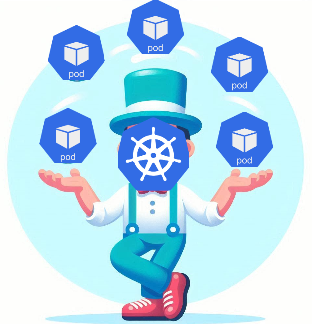
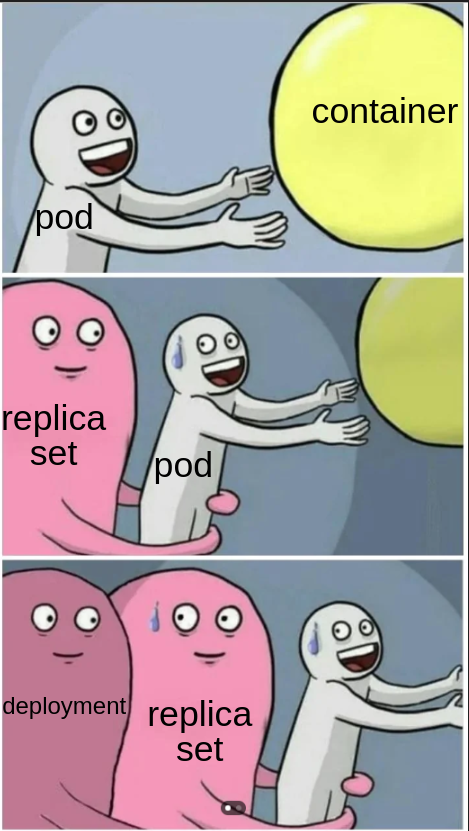

#### Juggling Kubernetes Workloads




---


Darshan Raul

```
Senior devops engineer, Vayana Network
Linkedin: https://www.linkedin.com/in/darshanraul/
Twitter/X: https://x.com/280chardevops

```

---

###  k8s turns 10

> what it means for the industry?

--

- ubiqutous
- truly cloud native
- stable and the de facto standard
- revolutionized the way we deploy, scale, and manage containerized applications
- and much much more!

---

### Agenda 

:fa-angle-down: :fa-angle-down: ALL OF THESE :fa-angle-down: :fa-angle-down:

--

nope just the workloads :D  


---

### Lets start ??

- Some of this may be overwhelming. Just try to understand the flow of everything
- This could be repetitive for some of us but its always good to brush up with the basics
- We will be focusing on the `why` of each workload
- Starting with a birds eye view of the k8s cluster components
- And before that lets go through server world

---

A typical cluster looks like this


---

# POD

- the smallest deployable unit
- environment for running container(s). 

--

### why a pod not a container?

--

- k8s is like running your own cloud
in that context pod is like a vm
and containers are like processes running in it

--

### Characteristics of a Pod

- immutable
- shared storage and network resources
- Pods have a lifecycle - they are created, assigned a unique ID (UID), and scheduled to run on a node until their termination or deletion.
- Each pod gets its own IP address, which allows containers within the pod to communicate with each other
-  can access storage volumes which can persist beyond the lifetime of an individual container.

--

single container example

```
apiVersion: v1
kind: Pod
metadata:
  name: nginx
spec:
  containers:
  - name: nginx
    image: nginx:1.14.2 
    ports:
    - containerPort: 80
```

--

multi container example


```
apiVersion: v1
kind: Pod
metadata:
  name: nginx-fluentd-pod
spec:
  containers:
  - name: nginx
    image: nginx:latest
    ports:
    - containerPort: 80
    volumeMounts:
    - name: shared-logs
      mountPath: /var/log/nginx
  - name: fluentd
    image: fluent/fluentd:latest
    volumeMounts:
    - name: shared-logs
      mountPath: /var/log/nginx
  volumes:
  - name: shared-logs
    emptyDir: {}

```

--

- side car containers
- init containers
- ephemeral containers

--

### you never run a pod directly

- designed as ephemeral, disposable entities


---

### Replicaset


- ensures a specified number of replicas (i.e., copies) of a pod are running at any given time.
- Self-Healing: If a replica fails, the ReplicaSet automatically restarts it to maintain the desired number of replicas.
- can scale up or down based on the desired number of replicas.
- including a selector that specifies how to identify Pods it can acquire

--

```
apiVersion: apps/v1
kind: ReplicaSet
metadata:
  name: frontend
  labels:
    app: guestbook
    tier: frontend
spec:
  # modify replicas according to your case
  replicas: 3
  selector:
    matchLabels:
      tier: frontend
  template:
    metadata:
      labels:
        tier: frontend
    spec:
      containers:
      - name: php-redis
        image: us-docker.pkg.dev/google-samples/containers/gke/gb-frontend:v5

```

--

Cons

- Manual Process: With ReplicaSets, you need to manually update the image or other configurations and ensure that the new pods replace the old ones correctly.
- No Historical Tracking


---

### Deployment

Managing replicasets, thats what I do!

--



--

- automate the rollout of new versions of an application or its configuration
- can roll back to a previous version
- can scale up or down based on the desired number of replicas [HPA]
-

--

```
apiVersion: apps/v1
kind: Deployment
metadata:
  name: nginx-deployment
  labels:
    app: nginx
spec:
  replicas: 3
  selector:
    matchLabels:
      app: nginx
  template:
    metadata:
      labels:
        app: nginx
    spec:
      containers:
      - name: nginx
        image: nginx:1.14.2
        ports:
        - containerPort: 80

```

---

There are more workloads!


---

# jobs

if you have one time tasks instead of constantly running services, eg file processing 
 - you can run them parallely
 - pods go in completed state after the task is done


--

```
apiVersion: batch/v1
kind: Job
metadata:
  name: busybox-job
spec:
  template:
    metadata:
      labels:
        app: busybox
    spec:
      containers:
      - name: busybox
        image: busybox:latest
        command: ["sh", "-c", "echo Hello, Kubernetes!"]
      restartPolicy: Never
  backoffLimit: 4

```

---

# Cron jobs

Just jobs on a timer


--

--

```
apiVersion: batch/v1
kind: CronJob
metadata:
  name: busybox-cronjob
spec:
  schedule: "* * * * *"
  jobTemplate:
    spec:
      template:
        metadata:
          labels:
            app: busybox
        spec:
          containers:
          - name: busybox
            image: busybox:latest
            command: ["sh", "-c", "echo Hello, Kubernetes!"]
          restartPolicy: Never
```

---

### Daemon sets

Used for deploying background services across clusters, providing support services for every node


--

- system operations services, collecting logs, monitoring frameworks like Prometheus, and storage volumes.
- ensures that all (or some) Nodes run a copy of a Pod. 
- As nodes are added to the cluster, Pods are added to them.
- when a node is removed from the cluster, the pod is removed

--

```
apiVersion: apps/v1
kind: DaemonSet
metadata:
 name: fluentd
spec:
 selector:
   matchLabels:
     app: fluentd
 template:
   metadata:
     labels:
       app: fluentd
   spec:
     containers:
     - name: fluentd
       image: fluent/fluentd
       volumeMounts:
       - name: varlog
         mountPath: /var/log
       - name: varlibdockercontainers
         mountPath: /var/lib/docker/containers
         readOnly: true
     terminationGracePeriodSeconds: 30
     volumes:
     - name: varlog
       hostPath:
         path: /var/log
     - name: varlibdockercontainers
       hostPath:
         path: /var/lib/docker/containers

```

---

# Statefulsets


TLDR: when you want to run apps like these in k8s

- MySQL
- PostgreSQL
- MongoDB
- Redis
- Memcached

--

- A new Pod is created by cloning the previous Pod’s data. 
- If the previous Pod is in the pending state, then the new Pod will not be created.
- If you scale down, it will delete the Pod in reverse order, not in random order.
- Ordered numbers for each Pod
- pods have sticky identity starting from zero, such as pod0,pod1,pod2, and so forth.

---

### Summary

Workload |  Purpose
------------ | -------------
pods | ephemeral containers
Deployments | Stateless applications, rolling updates
ReplicaSets | Used primarily by Deployments
StatefulSets | Databases, distributed systems
DaemonSets | logging, monitoring, or other daemons
Jobs | Batch processing, short-lived tasks
CronJobs | Periodic tasks, scheduled reports


---

# Demo Time

Find code here: https://github.com/280chardevops/kubernetes-workloads/

---

### What next?


- Explore volume mounts
- Explore Services
- Explore HPA
- Explore probes


