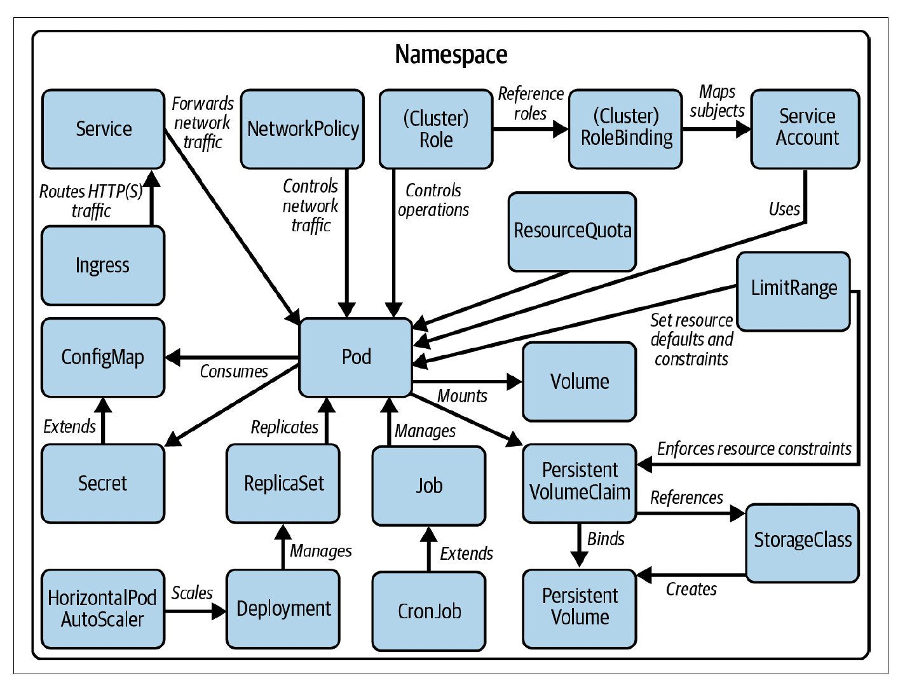
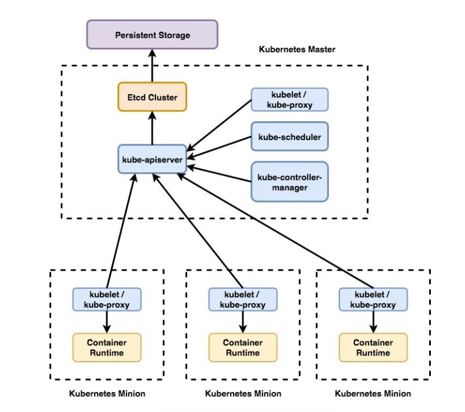

### Juggling Kubernetes Workloads

Keeping All the Pods in the Air!

--


---

###  k8s turns 10

> what it means for the industry?

--

- ubiqutous
- truly cloud native
- stable and the de facto standard
- revolutionized the way we deploy, scale, and manage containerized applications
- and much more!

---

### Agenda 

:fa-angle-down: :fa-angle-down: ALL OF THESE :fa-angle-down: :fa-angle-down:

--

nope just the workloads :D  



---

### Lets start ??

- Some of this may be overwhelming. Just try to understand the flow of everything

- This could be repetitive for some of us but its always good to brush up with the basics

- Starting with a birds eye view of the k8s cluster components

---

Cluster looks like this



---

# POD

- the smallest deployable units
- environment for running container(s). 

--

### why a pod not a container?

--

  - k8s is like running your own cloud
  in that context pod is like a vm
  and containers are like processes running in it
  - containers can talk to each other inside a pod

--

Example yaml

```
apiVersion: v1
kind: Pod
metadata:
  name: nginx
spec:
  containers:
  - name: nginx
    image: nginx:1.14.2 
    ports:
    - containerPort: 80
```

--

- mention side car containers
- init containers
- probes

--

### you never run a pod directly

- designed as relatively ephemeral, disposable entities

---


### Summary

 workload |  Purpose
------------ | -------------
pods | ephemeral containers
Deployments | Stateless applications, rolling updates
ReplicaSets | Used primarily by Deployments
StatefulSets | Databases, distributed systems
DaemonSets | logging, monitoring, or other daemons
Jobs | Batch processing, short-lived tasks
CronJobs | Periodic tasks, scheduled reports


---


# Replica set

what if i want to create multiple pods, lets say 3
what if one goes down, who will start it back?

Replica set [mention replication controller was its predecssor]


# Deployments

it manages replicasets
rollbacks etc

how? labels


# jobs

if you have one time tasks instead of constantly running services, eg file processing 

# Cron jobs

# Daemon sets

when we always need 

# Statefulsets

the pods running above were stateless
ok for apps
not ok for databases

stateful set includes running pods in a sequence in 


# Api server 

## controller manager
    - there are various controllers which handle this

# Services

- services help connect to the deployments


# Additional resources

- sayam pathak playlist
- kubectl cheatsheet


